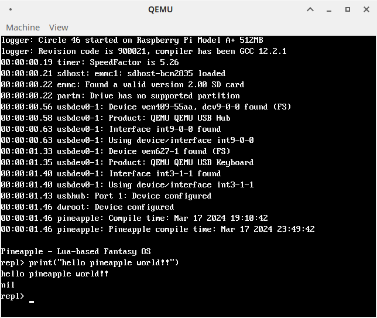

# Pineapple

**Pineapple** is a work-in-progress Lua-based fantasy operating system for Raspberry Pi. It utilizes [Circle](https://github.com/rsta2/circle) and [circle-stdlib](https://github.com/smuehlst/circle-stdlib) to create a minimal bootable system. In other words, it runs "bare metal" and does not use Linux. Pineapple is inspired by and partially based on [LUPOS](https://github.com/olfp/lupos).

Due to being a work-in-progress project, no stable builds will be provided for now. However, automated builds are provided for Pi 1 models, see the [Actions](https://github.com/ry755/pineapple/actions) tab for downloads.

### Fantasy... OS??

I realize that this is a strange name for it. However, I don't consider this to be a true fantasy computer or console due to the fact that it runs on a real hardware platform. I also don't consider this to be a "real" operating system due to the fact that all of the low level details are taken care of by Circle, I am simply coupling the Lua interpreter to it. So, "fantasy OS" it is!

# Screenshot



# Building

First, ensure you clone this repository with `--recursive` in order to clone all of the required submodules. Then run the applicable commands below. If booting on a real Raspberry Pi, copy the contents of the `root` folder to your SD card, along with the firmware files downloaded by the command below.

This has only been tested on a Raspberry Pi 1 B+. It *should* run on any model that Circle is compatible with, which at the time of writing is all models up to the Raspberry Pi 5, but I can not guarantee that.

To build Circle, circle-stdlib, and Pineapple:
```sh
./configure -r 1 # replace 1 with your Pi model, only needed for the first build
make libs # only needed for the first build
make
```

To download the needed firmware to boot on a real Raspberry Pi:
```sh
make -C circle-stdlib/libs/circle/boot/
```

To boot in QEMU: (note that you will need a patched build of QEMU, available [here](https://github.com/smuehlst/qemu))
```sh
make qemu
```

# Thanks

This would not be possible without the work of Rene Stange ([Circle](https://github.com/rsta2/circle)), Stephan Mühlstrasser ([circle-stdlib](https://github.com/smuehlst/circle-stdlib)), philanc ([Pure Lua Editor](https://github.com/philanc/ple)), et al. Thank you so much!

# License

Due to the fact that this links with Circle and circle-stdlib, this project is licensed under the GPL-3.0 license. See the [LICENSE](/LICENSE) file for details.
